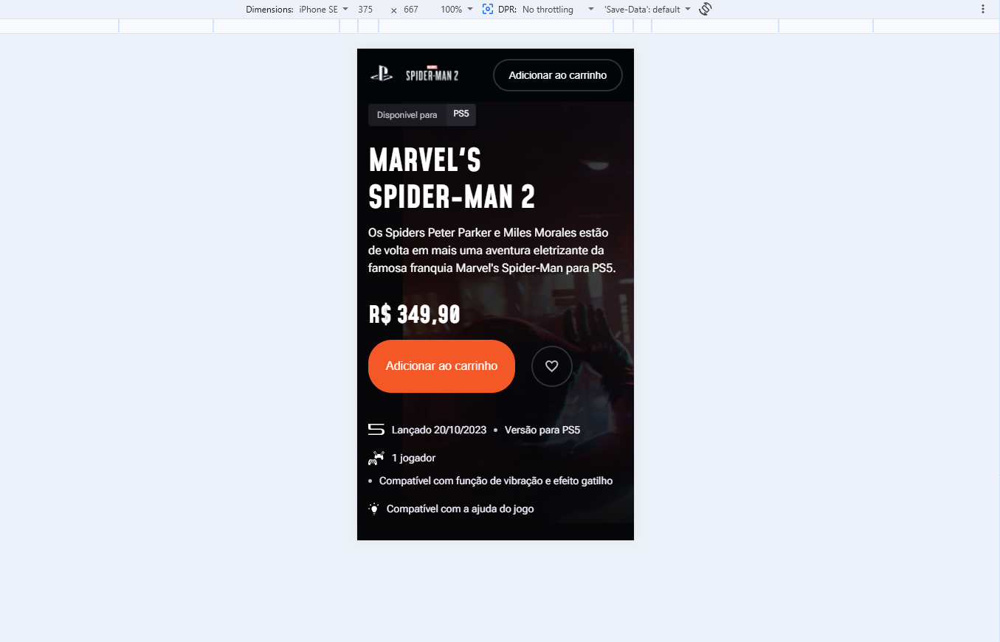
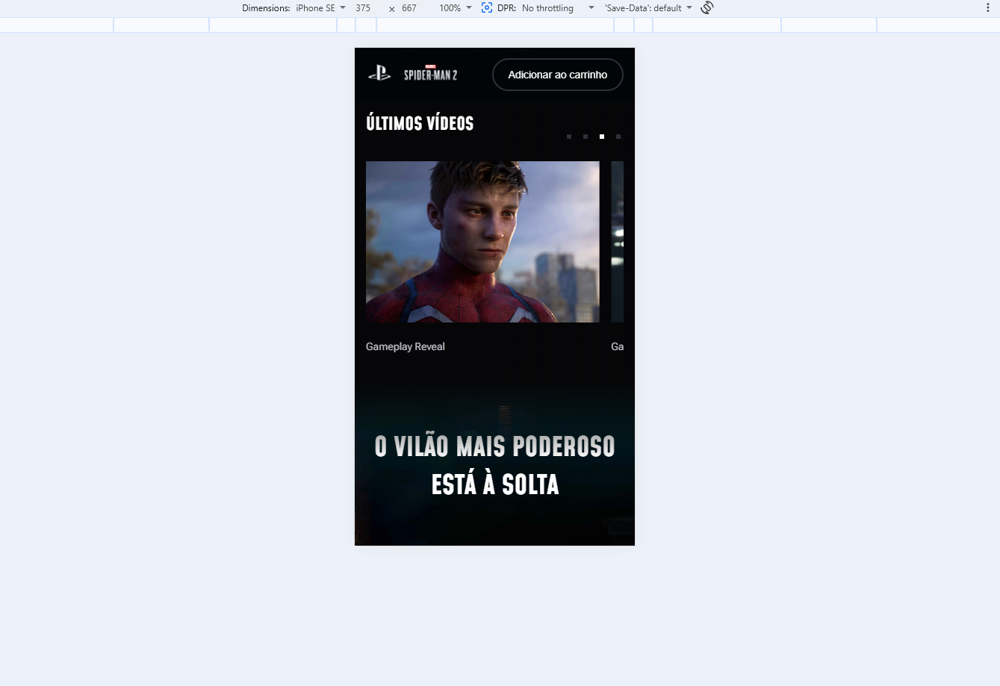
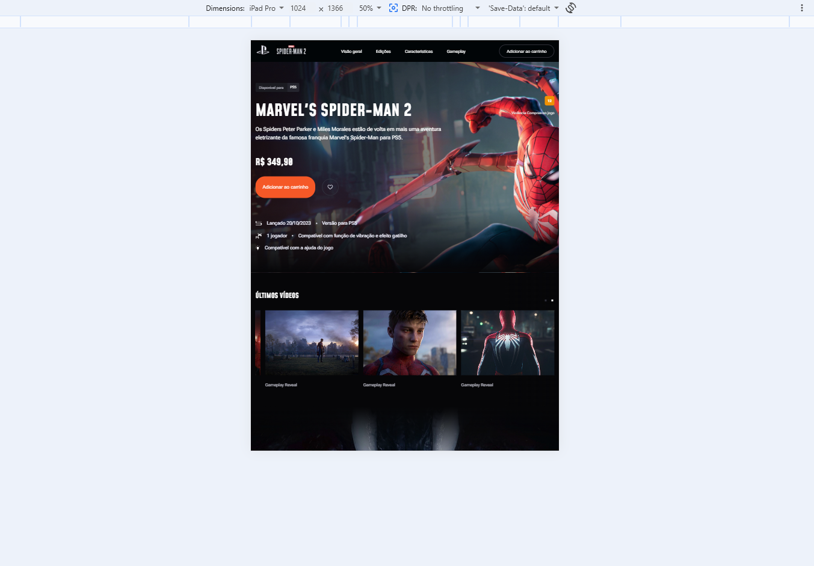
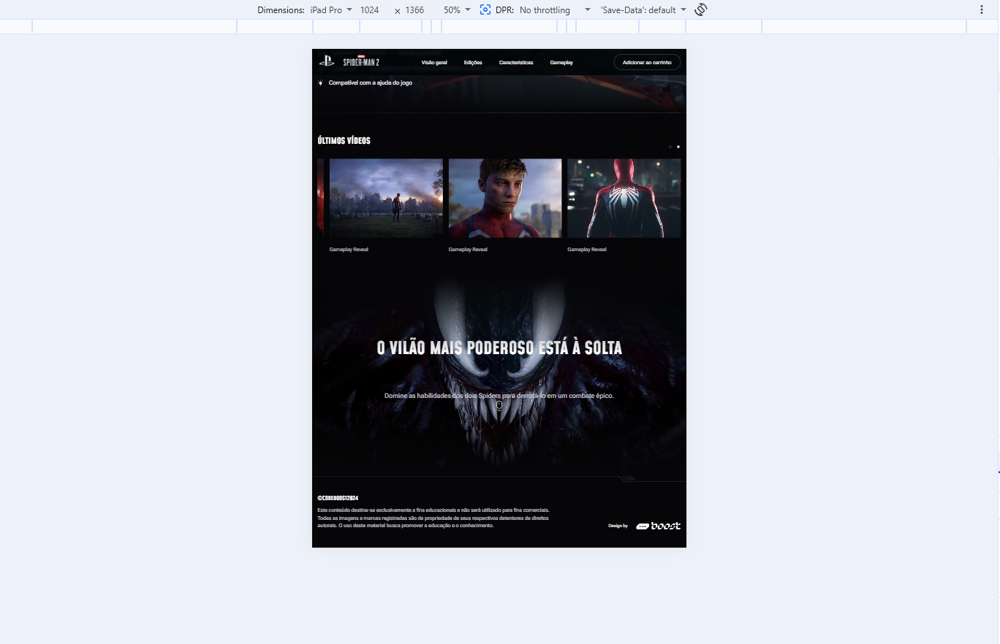

# 🕷️ Spider-Man 2 Landing Page

Projeto de uma landing page inspirada no jogo *Marvel's Spider-Man 2*, desenvolvido com foco em front-end moderno, responsividade e experiência visual.

---

## 📸 Preview do Projeto

### 💻 Desktop

<p align="center">
  
</p>

<p align="center">
  
</p>

---

### 📱 Mobile

<p align="center">
  
  
</p>

---

### 📲 Tablet

<p align="center">
  
  
</p>

---

## 🚀 Tecnologias utilizadas

* HTML5
* CSS3
* JavaScript (Vanilla)
* Swiper.js
* Google Fonts

---

## 🎨 Funcionalidades

* Layout moderno e responsivo
* Adaptação para desktop, mobile e tablet
* Seção hero com destaque do produto
* Carrossel interativo de vídeos com Swiper
* Animações em CSS
* Navegação simples e intuitiva

---

## 📁 Estrutura do projeto

```bash
portifolio-01/
│
├── css/
│   └── styles.css
│
├── js/
│   └── scripts.js
│
├── img/
│   ├── preview-1.png
│   ├── preview-2.png
│   ├── preview-3.png
│   ├── preview-4.png
│   ├── preview-5.png
│   └── preview-6.png
│
├── html/
│   └── index.html
│
└── README.md
```

---

## ▶️ Como rodar o projeto

```bash
git clone https://github.com/Lmac-og/Front-end-Homem-Haranha-2.git
cd Front-end-Homem-Haranha-2
```

Abra:

```bash
html/index.html
```

Ou simplesmente abra no navegador.

---

## 💡 Objetivo do projeto

Projeto desenvolvido para prática de front-end com foco em:

* Interfaces modernas
* Responsividade
* Experiência do usuário (UI/UX)

---

## 👨‍💻 Autor

**Leonardo Henrique Maciel Ferreira**
