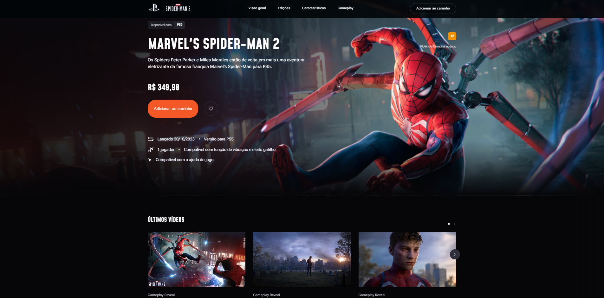

# 🕷️ Spider-Man 2 Landing Page

Projeto de uma landing page inspirada no jogo *Marvel's Spider-Man 2*, desenvolvido com foco em front-end moderno, responsividade e experiência visual.

---

## 📸 Preview do Projeto

<p align="center">
  
</p>

<p align="center">
  
</p>

---

## 🚀 Tecnologias utilizadas

* HTML5
* CSS3
* JavaScript (Vanilla)
* Swiper.js (carrossel de vídeos)
* Google Fonts

---

## 🎨 Funcionalidades

* Layout moderno e responsivo
* Seção hero com destaque do produto
* Carrossel interativo de vídeos com Swiper
* Animações em CSS (fade e troca de background)
* Navegação simples e intuitiva
* Estrutura organizada por pastas

---

## 📁 Estrutura do projeto

```bash
portifolio-01/
│
├── css/
│   └── styles.css
│
├── js/
│   └── scripts.js
│
├── img/
│   ├── preview-1.png
│   └── preview-2.png
│
├── html/
│   └── index.html
│
└── README.md
```

---

## ▶️ Como rodar o projeto

Clone o repositório:

```bash
git clone https://github.com/seu-usuario/seu-repositorio.git
```

Acesse a pasta:

```bash
cd seu-repositorio
```

Abra o projeto:

```bash
html/index.html
```

Ou simplesmente abra no navegador.

---

## 💡 Objetivo do projeto

Este projeto foi desenvolvido com foco em prática de front-end, explorando:

* Interfaces modernas
* Responsividade
* Organização de código
* Experiência do usuário (UI/UX)

---

## 👨‍💻 Autor

Desenvolvido por Leonardo henrique Maciel ferreira 🚀
